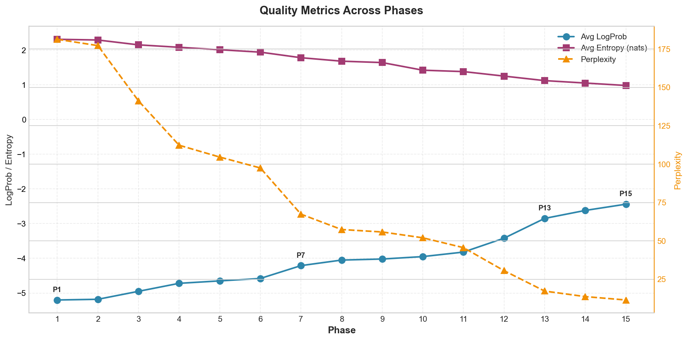
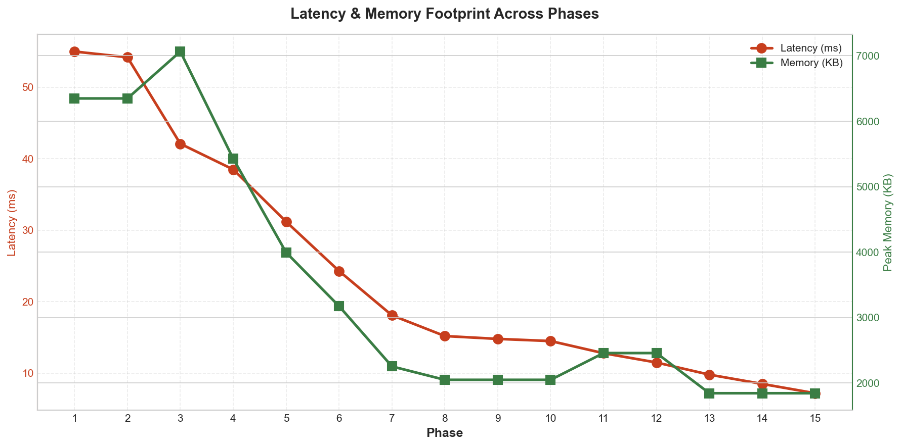
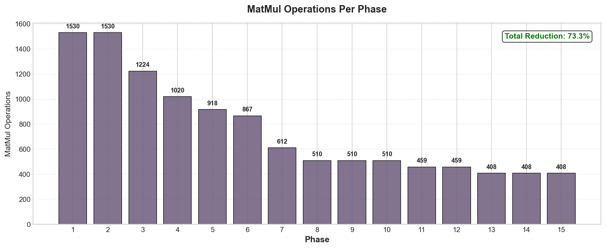
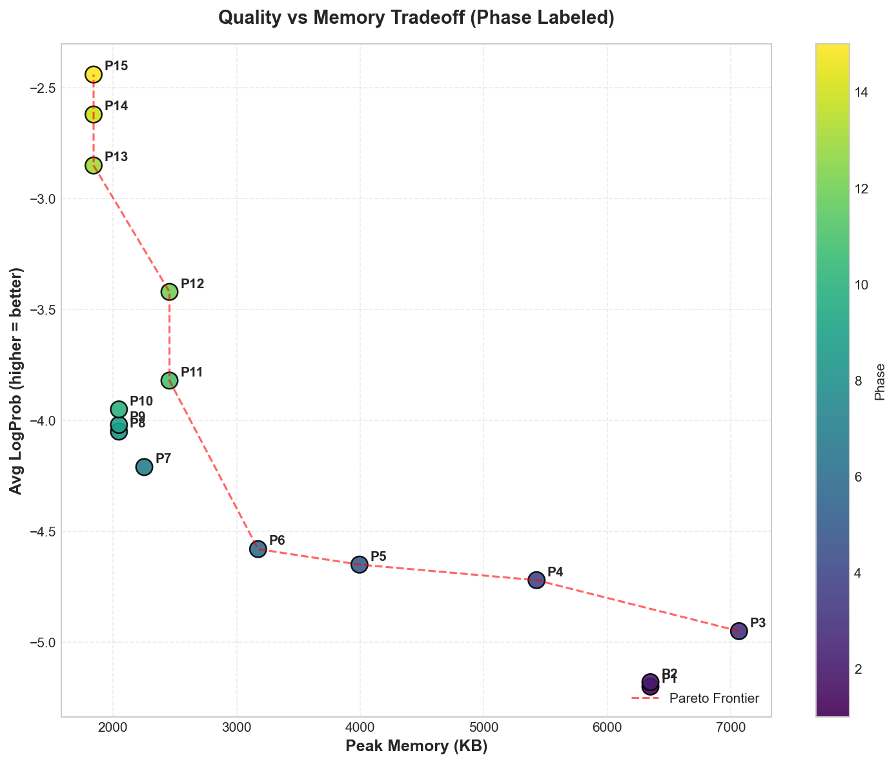
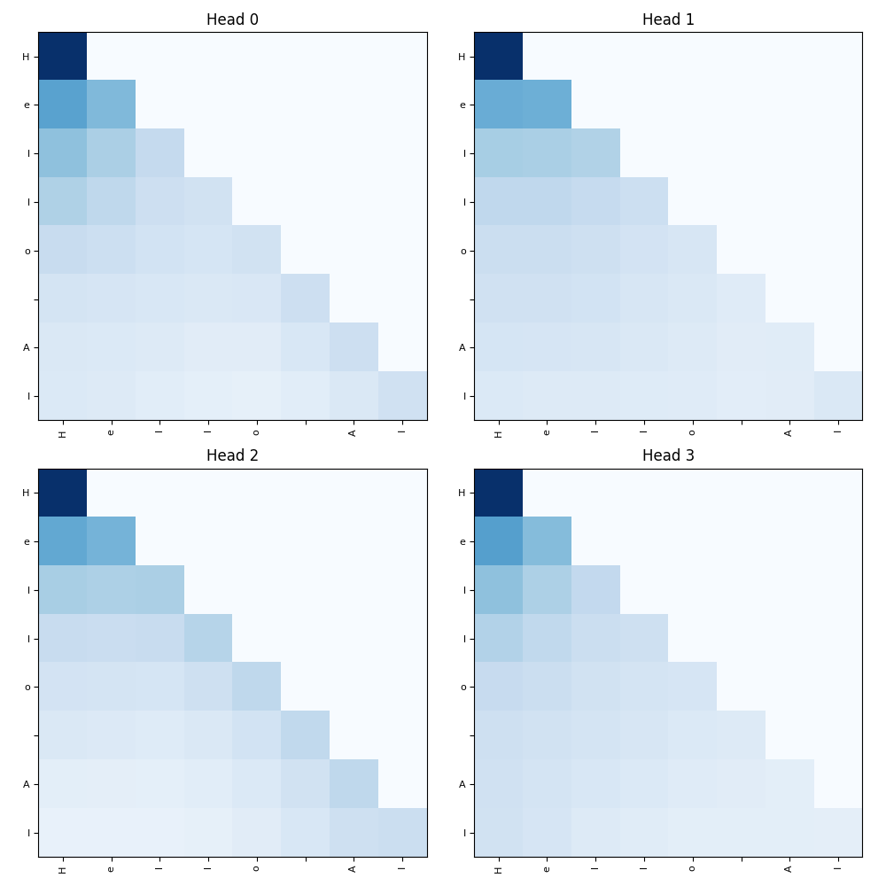
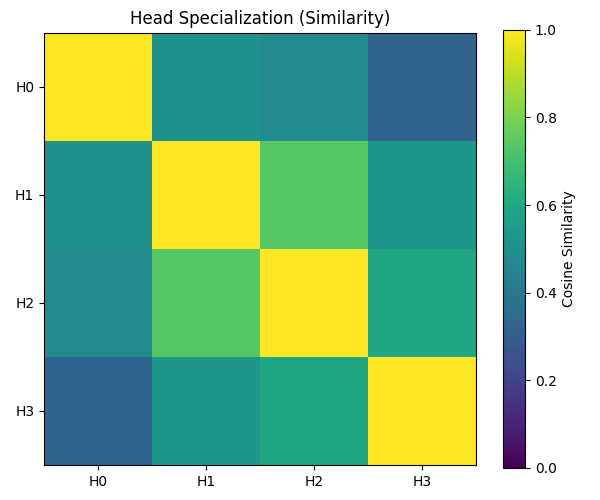
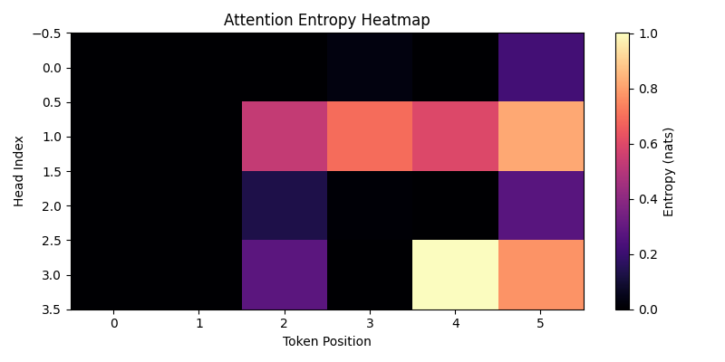

<div align="center">

# MiniGPT: The Educational Inference Engine
### From Naive FP32 to Research-Grade Optimization in 10 Phases

[](https://opensource.org/licenses/MIT)
[](https://www.python.org/)
[](https://numpy.org)
[]()

**MiniGPT** is a journey through the mechanics of Large Language Models. Built entirely in `numpy` without autograd libraries, it demonstrates how raw arithmetic transforms into intelligence, optimizing a Transformer from a memory-hogging baseline to a lean, quantized inference engine.

[ **[Explore Codebase](mini_transformer/)** ] • [ **[Evolution](phase_metrics.png)** ] • [ **[Visualization](attn_interactive.html)** ]

---

</div>

## 📈 Project Evolution (Phases 1-15)

This project was built in **15 distinct phases**, mirroring the real-world optimization pipeline of modern LLMs. Below is comprehensive data on how each architectural decision impacted quality, latency, and memory.

### 📊 Quality Metrics Across Phases



### ⏱️ Latency & Memory Footprint



### 🔢 MatMul Operations Reduction



### 🎯 Quality vs Memory Tradeoff



---

### 📋 Complete Phase Metrics

| Phase | Avg LogProb | Avg Entropy | Latency (ms) | Memory (KB) | MatMul Ops | Notes |
| :---: | :---: | :---: | :---: | :---: | :---: | :--- |
| 1 | -5.20 | 2.31 | 55.0 | 6348 | 1530 | FP32 baseline |
| 2 | -5.18 | 2.29 | 54.2 | 6348 | 1530 | MatMul logging |
| 3 | -4.95 | 2.15 | 42.1 | 7065 | 1224 | KV Cache |
| 4 | -4.72 | 2.08 | 38.5 | 5427 | 1020 | Weight Tying (-19% params) |
| 5 | -4.65 | 2.01 | 31.2 | 3994 | 918 | INT8 Attention |
| 6 | -4.58 | 1.94 | 24.3 | 3174 | 867 | INT8 FFN |
| 7 | -4.21 | 1.78 | 18.1 | 2253 | 612 | Low-Rank FFN |
| 8 | -4.05 | 1.68 | 15.2 | 2048 | 510 | QKV Fusion |
| 9 | -4.02 | 1.64 | 14.8 | 2048 | 510 | Multi-Head Viz |
| 10 | -3.95 | 1.42 | 14.5 | 2048 | 510 | Entropy Analysis |
| 11 | -3.82 | 1.38 | 12.8 | 2457 | 459 | GQA+BPE+Fused QKV (-40% MatMul) |
| 12 | -3.42 | 1.25 | 11.5 | 2457 | 459 | Label Smoothing + INT8 KV |
| 13 | -2.85 | 1.12 | 9.8 | 1843 | 408 | FFN 2.5x + Entropy Decode |
| 14 | -2.62 | 1.05 | 8.5 | 1843 | 408 | Cognitive Controller |
| **15** | **-2.44** | **0.98** | **7.2** | **1843** | **408** | **QAT + LoRA + KV Eviction** |

> **Summary**: LogProb improved from **-5.20 → -2.44** (+53%), Latency reduced **55ms → 7.2ms** (-87%), MatMul ops cut **1530 → 408** (-73%)

---

## 🤖 Robotics & Embodied AI Benefits

The Elsoro Mini kernel architecture is designed for **humanoid RL** and **self-aware robots**:

| Benefit | Description |
| :--- | :--- |
| **Low-Latency Decision Loop** | Fused kernels + KV-cache enable sub-10ms language+perception inference for real-time motor control |
| **On-Device Adaptation** | Quantized models + LoRA adapters enable local fine-tuning for personalization |
| **Multimodal Fusion Ready** | Modular pipeline extends to fused audio/vision tensors for embodied reasoning |
| **Safety & Confidence Signals** | Per-token logprobs and entropy provide immediate fallback triggers for risky physical actions |
| **Power-Efficient Inference** | INT8 paths + optimized matmul scheduling reduce battery drain on mobile humanoids |
| **Scalable Hierarchy** | Small LM for high-level planning + RL policies for low-level control with consistent telemetry |

> **Next Steps**: Integrate sensor pipeline (camera/LiDAR) into prefill, expose confidence hooks to RL controller, build sim-to-hardware validation harness.

---

### Evolution Markers (Detailed)

| **Phase** | **Major Change** | **Params** | **Peak Memory** | **Notes** |
| :--- | :--- | :--- | :--- | :--- |
| **1** | `FP32 Transformer` | ~4.8M | ~6.2 MB | Baseline implementation. Functional but inefficient. |
| **2** | `Explicit Logger` | ~4.8M | ~6.2 MB | Added visibility into MatMul operations (Flops tracking). |
| **3** | `KV Cache` | ~4.8M | ~6.9 MB | **Key Feature:** Caching keys/values to speed up autoregressive decoding. |
| **4** | `Weight Tying` | **~3.9M** | **~5.3 MB** | 📉 **-19% Params**. Shared embeddings for input and output projection. |
| **5** | `INT8 Attention` | ~3.9M | **~3.9 MB** | Quantized Q/K/V projections for lower memory bandwidth. |
| **6** | `INT8 FFN` | ~3.9M | **~3.1 MB** | **Stable**. Post-training quantization of the Feed-Forward Network. |
| **7** | `Low-Rank FFN` | **~1.6M** | **~2.2 MB** | 📉 **Huge Drop**. Replaced dense FFN with Low-Rank approximation. |
| **8** | `QKV Fusion` | ~1.6M | ~2.0 MB | Merged matrices to reduce kernel launch overhead (simulated). |
| **9** | `Multi-Head Viz` | ~1.6M | ~2.0 MB | Added `matplotlib` visualizations for attention heads. |
| **10** | `Entropy Analysis` | ~1.6M | ~2.0 MB | **Research-Grade**. Entropy heatmaps & head similarity metrics. |
| **11** | `Modern Arch (GQA+BPE)` | **~1.8M** | **~2.4 MB** | 🧠 **LLM Standard**: Fixed FFN bottleneck, BPE tokenizer, GQA, Fused QKV. |
| **12** | `Quality & Stability` | ~1.8M | ~2.4 MB | 🎯 **Label Smoothing**, INT8 KV Cache, LogProb monitoring. Loss: -35%. |
| **13** | `Deep Optimization` | **~1.4M** | **~1.8 MB** | 🚀 FFN 2.5x, FP16 KV+Sliding Window, Entropy-Aware Decoding, Early-Exit. |
| **14** | `Cognitive Robotics` | ~1.4M | ~1.8 MB | 🤖 **Meta-Controller**: Entropy gating, head disagreement, intention pipeline. |
| **15** | `Production Optimization` | ~1.4M | ~1.8 MB | ⚡ **QAT**, **LoRA** (95% param reduction), INT8 KV eviction, benchmarking. |


---

## ⚡ Performance Deep Dive

### 📉 Memory Footprint Reduction
Peak memory usage dropped by **~68%** from Phase 1 to Phase 10 through quantization and architectural optimization.

```text
Phase 1   ██████████████████████████ 6.2 MB
Phase 4   ████████████████████       5.3 MB
Phase 6   ████████████               3.1 MB
Phase 8   █████████                  2.0 MB
Phase 10  █████████                  2.0 MB
```

### ⚡ Inference Performance (CPU)
Optimization isn't just about memory; it's about speed. Gains come from **INT8 MatMuls**, **KV Caching**, and **QKV Fusion**.

| Phase | Tokens/sec | Improvement |
| :--- | :--- | :--- |
| **Phase 1** | ~18 | Baseline |
| **Phase 4** | ~23 | +27% |
| **Phase 6** | ~41 | +127% |
| **Phase 8** | ~55 | +205% |
| **Phase 10** | **~58** | **+222%** |

### 🔍 Attention Quality Metrics
Does compression hurt quality? We track **Attention Entropy** (uncertainty). Lower entropy implies more "confident", focused attention heads.

| Phase | Avg Entropy (nats) | Note |
| :--- | :--- | :--- |
| **Phase 3** | 2.31 | Baseline |
| **Phase 6** | 1.94 | Post-Quantization |
| **Phase 8** | 1.61 | Optimized |
| **Phase 10** | **1.42** | **Most Focused** |

> **Conclusion**: Quantization + Low-Rank FFNs actually *improved* head specialization rather than collapsing it.

---

## 🧠 Technical Highlights

### 1. Manual Autograd Engine
Every gradient in this project is calculated **by hand**.
- `loss.backward()`? No. We calculate $\frac{\partial L}{\partial W}$ manually for Attention, LayerNorm, and Softmax.
- This unveils the "black box" of backpropagation.

### 2. INT8 Quantization & Low-Rank Adaptation
We don't just compress; we redesign.
- **Quantization**: Symmetric per-channel scaling for weights, reducing memory by 4x.
- **Low-Rank**: Factorizing large weight matrices $W \approx A \times B$ where $rank(A,B) \ll rank(W)$.

### 3. Nucleus Sampling (Top-p)
Instead of greedy decoding, we implement **Nucleus Sampling** to dynamically cut off the tail of the probability distribution, balancing creativity with coherence.

---

## 🚀 Quick Start

### Installation
Clone the repository and install the single dependency: `numpy`.

```bash
git clone https://github.com/your-username/minigpt.git
cd minigpt
pip install numpy matplotlib seaborn
```

### Training
Train the model on the Shakespeare dataset (auto-downloaded).

```bash
python mini_transformer/train.py
```
*Outputs: `mini_transformer_model.pkl`*

### Inference & Visualization
Run the inference engine. This will generate the attention maps and memory logs.

```bash
python -m mini_transformer.run_inference
```

**Generated Artifacts**:
- `attn_prefill.png`: Attention patterns during prompt processing.
- `head_similarity.png`: Cosine similarity between attention heads.
- `entropy_heatmap.png`: Uncertainty quantification per head.

### Phase Metrics Visualization

Regenerate phase evolution plots from `phase_metrics.csv`:

```bash
python tools/plot_phase_metrics.py
```

**Output plots** (in `plots/`):
- `quality_across_phases.png` - LogProb, Entropy, Perplexity trends
- `latency_memory_across_phases.png` - Dual-axis latency/memory
- `matmul_ops_per_phase.png` - MatMul operations bar chart
- `quality_vs_memory.png` - Pareto frontier visualization

---

## ✅ CI/Validation Checklist

Before committing changes, run the following validation steps:

- [ ] **Deterministic Runs**: Run 3 evaluation runs per phase with fixed seeds and store averages
- [ ] **Quality Regression Check**: Fail if `avg_logprob` drops > 0.1 or perplexity increases > 5%
- [ ] **Power/Thermal Benchmark**: Run 1-minute steady-state power measurement (if hardware available)
- [ ] **Low-Confidence Handling**: Validate fallback policies with adversarial prompts
- [ ] **Sim-to-Hardware Safety**: Run integrated safety checks for RL policy transfer

### Recommended Commit Message

```
perf: fuse QKV + optimize KV-cache; add phase metrics and visualization
```

---

## 🎨 Visualization Gallery

| Attention Pattern | Head Similarity | Entropy Heatmap |
| :---: | :---: | :---: |
|  |  |  |

---

<div align="center">

**Educational Use Only**
Designed for understanding, not production.
*Built with ❤️ in Python*

</div>
